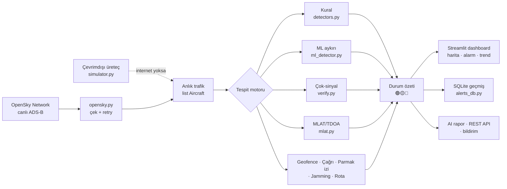

# 🛰️ SkyGuard

**Canlı uçak trafiğini izleyip spoofing / anomali / GPS-jamming tespit eden savunma aracı.**
Donanım gerekmez — veri halka açık [OpenSky Network](https://opensky-network.org) API'sinden gelir.

Havacılık + siber güvenlik + veri bilimi. Aynı savunma mimarisi **deniz (AIS)** ve **drone (RemoteID)** trafiğine de taşınır.

---

## Ne yapar?

Gökyüzündeki uçaklar konum/hız/irtifa verisini sürekli **şifresiz ve imzasız** yayınlar (ADS-B).
Bu yüzden sahte uçak enjekte edilebilir veya gerçek uçağın verisi bozulabilir. Bu araç o veriyi
çeker, analiz eder ve şüpheli/imkansız durumları tespit eder.

### Tespit katmanları

| Katman | Ne yakalar | Kesinlik |
|--------|-----------|----------|
| **Kural** | Işınlanma (imkansız hız), klon kimlik, irtifa sıçraması, acil kod (7500/7600/7700) | Kesin — fiziksel imkansız |
| **Çağrı doğrulama** | Çağrı işareti ↔ ülke uyuşmazlığı (sahte kimlik) | Yüksek |
| **Geofence** | Yasak/askeri bölgede alçak uçuş (izinsiz giriş) | Yüksek |
| **Çok-sinyal doğrulama** | Hız-vektör, yön, baro-GNSS tutarlılığı | Orta-yüksek |
| **Multilateration (MLAT)** | Bağımsız üçgenleme ile konum kanıtı | Kesin (alıcı verisi varsa) |
| **ML aykırı** | Filo genelinden sıradışı (mutlak eşik) | "İncele" — tehdit değil |
| **Rota sapması** | Bildirilen yönden farklı gidiş | "İncele" |
| **Karanlık uçak** | Sinyal aniden kesildi (transponder kapatma) | "İncele" |
| **GPS jamming** | Baro (GPS'siz) vs geometrik (GPS) irtifa sapması | Şüphe haritası |
| **Parmak izi** | Uçağın kendi normalinden sapması | "İncele" |

**Yanlış-pozitif düşük:** kural %0, geofence %0, ML ~%0.7 (canlı veriyle kalibre).

### Mimari — veri nasıl akıyor



Canlı veri gelmezse motor **çevrimdışı sentetik trafikle** aynı algoritmaları çalıştırır —
sunum/mülakatta internet olmadan da tespit gösterilir.

## Yasal mı?

Evet. Sadece halka açık veriyi **okur ve analiz eder**. Hiçbir sisteme erişim, hiçbir sinyal
yayını yok. Spoofing *tespit* eder, yapmaz. Tamamen savunma amaçlı.

---

## Hızlı başlangıç

```bash
pip install -r requirements.txt
streamlit run app.py
```

Tarayıcı açılır: `http://localhost:8501`

**İnternet yok / hemen denemek istiyorsun?** Sol menü → **🎬 Spoof demo modu** →
**🧪 Çevrimdışı mod**. OpenSky'a bağlanmadan sentetik trafik üretir; tespit motoru
gerçek algoritmalarla çalışır. Canlı veri bir an ulaşılamazsa dashboard **otomatik**
bu moda düşer (boş ekran vermez).

**Konsol versiyonu:**
```bash
python main.py --turkey          # Türkiye
python main.py --europe          # Avrupa
```

**Test:**
```bash
python test_all.py               # 133 offline test
python test_all.py --live        # + canlı OpenSky (136 toplam)
```

---

## Dashboard sekmeleri

- **🛩️ Trafik** — canlı harita (3D seçeneği), uçak arama/filtre, CSV indir, detay paneli
- **⚠️ Olaylar** — çağrı uyuşmazlığı, rota sapması, karanlık uçak, çakışma, geofence, parmak izi
- **📡 GPS Jamming** — jamming ısı haritası
- **🎯 MLAT** — multilateration demo + OpenSky MLAT verisi
- **📈 Alarm geçmişi** — trend grafiği + zaman makinesi (geçmiş replay)
- **🤖 AI Rapor** — Claude ile doğal dil tehdit raporu, PDF/HTML indir
- **🚢 Deniz (AIS)** — gemi spoofing tespiti (aisstream.io anahtarıyla canlı, anahtarsız demo)

Üstte **durum özeti** (🟢 SAKİN / 🟡 İZLE / 🔴 DİKKAT) tek bakışta tehdit seviyesi.
Sol kenarda **canlı radar** + kota göstergesi. Ayarlar/demo expander'larda (arayüz sade).

---

## Canlıya alma (Streamlit Community Cloud — ÜCRETSİZ)

**Sunucu ve domain bedava. 15 dakikada canlı, HTTPS'li URL.**

1. GitHub'a repo it (bu klasörü push et)
2. [share.streamlit.io](https://share.streamlit.io) → GitHub ile giriş → repoyu seç
3. Main file: `app.py`
4. **Advanced settings → Secrets** bölümüne `secrets.toml.example` içeriğini yapıştır, doldur
5. Deploy → `adsb-guard.streamlit.app` hazır

### ⚠️ Canlıda OpenSky hesabı ŞART

Anonim kota (~400/gün) sunucu IP'sine bağlı — herkes aynı kotayı paylaşır, hızla biter.
[OpenSky ücretsiz hesap](https://opensky-network.org) aç (4000/gün), secrets'a koy:

```toml
OPENSKY_USER = "kullanıcı"
OPENSKY_PASS = "parola"
```

### Alternatif platformlar

| Platform | Artı | Eksi |
|----------|------|------|
| **Streamlit Cloud** | Bedava, HTTPS, kolay | Kullanılmazsa uyur (~30s ilk açılış) |
| **Hugging Face Spaces** | Bedava, GitHub gerekmez | Uyku modu |
| **Fly.io** | Uyumaz, Dockerfile hazır | Kart ister |
| **Kendi VPS** (~4$/ay) | Tam kontrol, 7/24 | Para + kurulum |

Docker:
```bash
docker build -t adsb-guard .
docker run -p 8501:8501 adsb-guard
```

---

## Olgun ML modeli (opsiyonel)

Anlık öğrenme yerine önceden eğitilmiş model — ısınma beklemez:

```bash
python history_train.py collect --minutes 30    # 30 dk veri topla
python history_train.py train                    # eğit → model.pkl
```

Dashboard `model.pkl`'i otomatik yükler.

---

## Ek araçlar

```bash
python api.py                    # REST API: /health /alerts /aircraft /jamming
python notify.py "test"          # Telegram/Discord bildirim testi
python report.py                 # HTML/PDF rapor üret
```

---

## Dosyalar

| Dosya | İş |
|-------|-----|
| `app.py` | Streamlit dashboard (7 sekme) |
| `opensky.py` | OpenSky API istemcisi |
| `detectors.py` | Kural-tabanlı tespit |
| `ml_detector.py` | ML anomali (IsolationForest, mutlak eşik) |
| `verify.py` | Çok-sinyal çapraz doğrulama |
| `mlat.py` | Gerçek multilateration (TDOA) |
| `jamming.py` | GPS jamming tespiti |
| `events.py` | Karanlık uçak + çakışma |
| `geofence.py` | Yasak bölge ihlali |
| `fingerprint.py` | Uçak parmak izi |
| `callsign_db.py` | Çağrı işareti doğrulama |
| `predict.py` | Rota tahmini + uçak tipi |
| `enrich.py` | Güven skoru, askeri, sinyal kaynağı |
| `simulator.py` | Spoof demo + çevrimdışı sentetik trafik üreteci |
| `ai_report.py` | Claude tehdit raporu |
| `alerts_db.py` | SQLite geçmiş + zaman makinesi |
| `quota.py` | OpenSky kota koruma |
| `ais.py` | Deniz (AIS) spoofing tespiti |
| `drone.py` | Drone (RemoteID) tespiti |
| `history_train.py` | Kalıcı ML eğitimi |
| `api.py` / `notify.py` / `report.py` | REST API / bildirim / rapor |
| `test_all.py` | 133 test |
| `Dockerfile` | Konteyner |

---

## Yol haritası

- [x] Kural/ML tespiti, dashboard, GPS jamming, MLAT, çok-sinyal doğrulama
- [x] Çağrı doğrulama, rota tahmini, uçak tipi, karanlık uçak, çakışma, geofence, parmak izi
- [x] AIS deniz, drone RemoteID, kalıcı ML eğitimi, spoof demo
- [x] REST API, bildirim, PDF, Docker, 3D harita, radar, zaman makinesi, CSV
- [x] Çevrimdışı demo modu (internetsiz sentetik trafik) + otomatik fallback
- [x] Canlı AIS deniz beslemesi (aisstream.io WebSocket)
- [ ] **Gerçek RTL-SDR entegrasyonu** — kendi alıcınla canlı MLAT (~30$ donanım)
- [ ] **LSTM trajektori** — derin öğrenme anomali (deploy için ağır; yerel/GPU gerekir)
- [ ] **Yerel RemoteID drone alıcısı** — canlı drone beslemesi
- [ ] Bulut 7/24 deploy

---

## Not — dürüstlük

Tespitler ADS-B verisine dayalı **şüphe** göstergeleridir. Kesin kanıt için gerçek
multilateration (birden fazla yer alıcısının ham zaman-damgası) gerekir — MLAT çözücüsü
hazır, alıcı verisi beslenirse spoofing'i kanıta çevirir.
